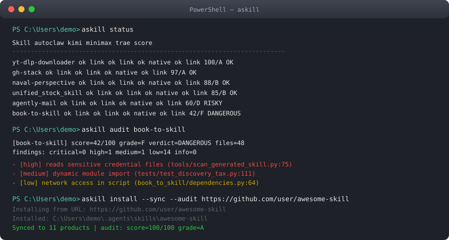

<div align="center">

# Agent Skill Manager

[English](README.en.md) | [简体中文](README.md)

[](https://github.com/yxdwind/agent-skill-manager/actions/workflows/ci.yml)
[](https://www.python.org/)
[](https://github.com/yxdwind/agent-skill-manager)
[](LICENSE)
[](#supported-products)

**Write once, sync everywhere** — Cross-platform skill management for 11 domestic Chinese AI agent products.

[Install](#install) · [Usage](#usage) · [Security Audit](#security-audit) · [Architecture](#architecture)

</div>

---

## The Problem

Every Chinese AI agent product keeps its skills in its own directory. Developing one skill means manually copying it to every product:

```
~/.openclaw/skills/my-skill/          <- AutoClaw
~/.config/agents/skills/my-skill/     <- Kimi
~/.workbuddy/skills/my-skill/         <- WorkBuddy
~/.trae/skills/my-skill/              <- Trae
~/.codebuddy/skills/my-skill/         <- CodeBuddy
~/.comate/skills/my-skill/            <- Comate
~/.qoderwork/skills/my-skill/         <- Qoder
... and again, every time you change it
```

**agent-skill-manager** solves this with a central repository + one-command distribution: edit once, sync everywhere.

## Supported Products (11)

| Product | Company | macOS Path | Windows Path | Sync Method |
|---------|---------|-----------|--------------|-------------|
| AutoClaw | Zhipu | `~/.openclaw/skills/` | `%USERPROFILE%\.openclaw\skills\` | symlink/junction |
| Kimi | Moonshot AI | `~/.config/agents/skills/` | `%USERPROFILE%\.config\agents\skills\` | symlink/junction |
| MiniMax Code | MiniMax | `~/.agents/skills/` | `%USERPROFILE%\.agents\skills\` | native |
| WorkBuddy | Tencent | `~/.workbuddy/skills/` | `%USERPROFILE%\.workbuddy\skills\` | symlink + settings.json |
| Trae | ByteDance | `~/.trae/skills/` | `%USERPROFILE%\.trae\skills\` | symlink/junction |
| DuMate | Baidu | App-managed | App-managed | pack .zip upload |
| CodeBuddy | Tencent | `~/.codebuddy/skills/` | `%USERPROFILE%\.codebuddy\skills\` | symlink + settings.json |
| Comate / Wenxin Kuaima | Baidu | `~/.comate/skills/` | `%USERPROFILE%\.comate\skills\` | symlink/junction |
| Qoder / Tongyi Lingma | Alibaba | `~/.qoderwork/skills/` | `%USERPROFILE%\.qoderwork\skills\` | symlink/junction |
| QwenWork / Qianwen Office | Alibaba | `~/.qwenworkcn/skills/` | `%USERPROFILE%\.qwenworkcn\skills\` | symlink/junction |
| DoubaoWork | ByteDance | `~/.super_doubao/super-doubao-runtime/workspace/.user_skills/` | `%LOCALAPPDATA%\DoubaoWork\User Data\Default\.doubaowork\agent_mode\workspace\.user_skills\` | symlink/junction |

## How It Works


**Core design**: the central repository `~/.agents/skills/` is the single source of truth. Skills are distributed to all products via symlinks (macOS) or junctions (Windows). For DuMate, which does not expose a filesystem, skills are packed as .zip for manual upload. QwenWork and DoubaoWork are synced the same way via junctions.

- **Windows**: junction via `mklink /J`, no admin rights needed
- **macOS**: symlink via `ln -s`
- **Automatic fallback**: falls back to copying if link creation fails
- **Zero dependencies**: Python standard library only



## Install

```bash
# Development install (recommended)
cd agent-skill-manager
pip install -e .

# If pip hits TLS certificate issues
python -m pip install -e . --no-build-isolation
```

After installation, the `askill` command is available globally.

You can also install the skill definition through the `npx skills` ecosystem:

```bash
npx skills add yxdwind/agent-skill-manager
```

## Usage

```bash
# Show installation status across products (with security audit score column)
askill status

# Sync all skills to all products
askill sync

# Sync a specific skill
askill sync my-skill

# List all skills in the central repository (with audit scores)
askill list

# Install a skill (local path or GitHub URL)
askill install /path/to/skill-folder
askill install --sync /path/to/skill-folder          # auto-sync after install
askill install --audit /path/to/skill-folder         # run security audit after install
askill install --sync --audit <github-url>           # sync + audit together

# Multiple GitHub URL formats are supported (default branch auto-detected)
askill install --sync https://github.com/user/repo                                # repo root SKILL.md
askill install --sync https://github.com/user/repo/tree/main/my-skill             # subdirectory on a branch
askill install --sync https://github.com/user/repo/blob/main/my-skill/SKILL.md    # direct SKILL.md link

# Adopt skills from one platform into the central repo and sync everywhere
askill adopt autoclaw my-skill                       # adopt one skill from AutoClaw
askill adopt kimi                                    # adopt all skills from Kimi

# Static security audit: prompt injection / dangerous code / secrets / binaries
askill audit                                         # audit all skills
askill audit my-skill                                # audit one skill

# Remove a skill from all products
askill remove my-skill

# Pack a skill as .zip for DuMate
askill pack my-skill

# List all supported products
askill products
```

### Typical Workflow

```
1. askill status          <- check installation status
2. edit ~/.agents/skills/my-skill/SKILL.md
3. askill sync my-skill   <- distribute to 10 products
4. askill pack my-skill   <- .zip for DuMate
```

## Project Structure

```
agent-skill-manager/
├── pyproject.toml              # PEP 621 project config
├── setup.py                    # setuptools compatibility entry
├── docs/
│   ├── architecture.svg        # architecture diagram
│   ├── demo.svg                # terminal demo
│   └── product-paths.md        # per-product path reference
├── src/                        # package root (mapped as agent_skill_manager)
│   ├── __init__.py / __main__.py
│   ├── config/products.py      # 11 product definitions
│   ├── controllers/cli.py      # CLI commands (10 commands)
│   ├── models/                 # TypedDict data shapes
│   ├── services/               # business logic (sync / audit)
│   └── utils/filesystem.py     # cross-platform filesystem ops
└── tests/                      # 76 tests
    ├── test_products.py
    ├── test_utils.py
    ├── test_core.py
    ├── test_adopt.py
    ├── test_security.py
    └── test_cli.py
```

## Security Audit

`askill audit` runs a **zero-dependency static analysis** on skills. It starts at 100 points and deducts by severity (capped at 40 per category):

| Dimension | Severity | Examples |
|-----------|----------|----------|
| Prompt injection | critical | "ignore all previous instructions", safety bypass language |
| Dangerous code | critical/high | `curl \| sh`, `rm -rf /`, `exec()`, `shell=True` |
| Secrets & exfiltration | high/medium | reading `~/.ssh`, hardcoded API keys, webhook URLs |
| Binary files | high | bundled `.exe`/`.dll` executables |
| File integrity | high/medium | missing SKILL.md, oversized files, symlinks |

**Scoring & verdict**: A >= 90 (safe) - B >= 80 (safe) - C >= 70 (caution) - D >= 60 (risky) - F < 60 (dangerous)

Scores also appear in `askill list` and `askill status` output. Add `--audit` to install for a one-step "install + audit":

```bash
askill install --sync --audit https://github.com/user/repo/tree/main/my-skill
```

## Extend It

### Add a New Product

Edit `src/config/products.py` and append to the `PRODUCTS` list:

```python
{
    "name": "New Product",
    "short": "short-name",
    "macos_path": HOME / ".newproduct" / "skills",
    "windows_path": HOME / ".newproduct" / "skills",
    "sync_method": "symlink",  # symlink | native | pack
    "note": "description",
    "extra_dirs_macos": [],
    "extra_dirs_windows": [],
}
```

### Run Tests

```bash
pip install pytest
pytest tests/ -v
```

## Related Projects

- [manage-my-skills](https://github.com/hchcx/manage-my-skills) — cross-platform skill manager for 20+ international products
- [awesome-agent-skills](https://github.com/libukai/awesome-agent-skills) — the ultimate Agent Skills guide
- [skills CLI](https://www.npmjs.com/package/skills) — npm-based agent skills package manager
- [skill-creator](https://github.com/yxdwind/agent-skill-manager) — skill authoring reference

## Contributors

Thanks to the following contributor:

- [**@GLM-5.2**](https://github.com/zai-org) — AI co-developer (Zhipu GLM-5.2)

## Security & Privacy

- [Security Policy (SECURITY.md)](SECURITY.md) — vulnerability reporting & security guidance
- [Privacy Policy (PRIVACY.md)](PRIVACY.md) — local-first data handling

## License

[MIT](LICENSE)
