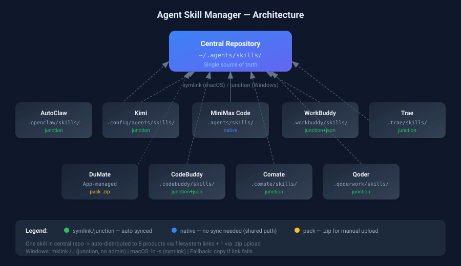

<div align="center">

# Agent Skill Manager

[](https://www.python.org/)
[](https://github.com/yxdwind/agent-skill-manager)
[](LICENSE)
[](tests/)
[](#支持的产品)

**一次开发，十一端同步** — 跨平台统一管理国内 AI Agent 产品的 Skill 安装与同步

[安装](#安装) · [使用](#使用) · [二次开发](#二次开发) · [架构原理](#架构原理)

</div>

---

## 痛点

每个国产 AI Agent 产品都有自己独立的 skill 目录，开发一个 skill 要手动复制到每个产品：

```
~/.openclaw/skills/my-skill/          ← AutoClaw
~/.config/agents/skills/my-skill/      ← Kimi
~/.workbuddy/skills/my-skill/          ← WorkBuddy
~/.trae/skills/my-skill/               ← Trae
~/.codebuddy/skills/my-skill/          ← CodeBuddy
~/.comate/skills/my-skill/             ← Comate
~/.qoderwork/skills/my-skill/          ← Qoder
... 每改一次都要重复一遍
```

**agent-skill-manager** 用「中央仓库 + 一键分发」解决这个问题：改一处，全同步。

## 支持的产品（11 个）

| 产品 | 公司 | macOS 目录 | Windows 目录 | 同步方式 |
|------|------|-----------|-------------|----------|
| AutoClaw | 智谱 | `~/.openclaw/skills/` | `%USERPROFILE%\.openclaw\skills\` | symlink/junction |
| Kimi | 月之暗面 | `~/.config/agents/skills/` | `%USERPROFILE%\.config\agents\skills\` | symlink/junction |
| MiniMax Code | MiniMax | `~/.agents/skills/` | `%USERPROFILE%\.agents\skills\` | 原生支持 |
| WorkBuddy | 腾讯 | `~/.workbuddy/skills/` | `%USERPROFILE%\.workbuddy\skills\` | symlink + settings.json |
| Trae | 字节跳动 | `~/.trae/skills/` | `%USERPROFILE%\.trae\skills\` | symlink/junction |
| DuMate | 百度 | App 内管理 | App 内管理 | 打包 .zip 上传 |
| CodeBuddy | 腾讯 | `~/.codebuddy/skills/` | `%USERPROFILE%\.codebuddy\skills\` | symlink + settings.json |
| Comate / 文心快码 | 百度 | `~/.comate/skills/` | `%USERPROFILE%\.comate\skills\` | symlink/junction |
| Qoder / 通义灵码 | 阿里 | `~/.qoderwork/skills/` | `%USERPROFILE%\.qoderwork\skills\` | symlink/junction |
| QwenWork / 千问办公 | 阿里 | `~/.qwenworkcn/skills/` | `%USERPROFILE%\.qwenworkcn\skills\` | symlink/junction |
| DoubaoWork / 豆包工作 | 字节跳动 | `~/.super_doubao/super-doubao-runtime/workspace/.user_skills/` | `%LOCALAPPDATA%\DoubaoWork\User Data\Default\.doubaowork\agent_mode\workspace\.user_skills\` | symlink/junction |

## 架构原理



**核心设计**：中央仓库 `~/.agents/skills/` 作为唯一权威源，通过 symlink（macOS）或 junction（Windows）自动分发到各产品。对不支持文件系统的 DuMate，打包为 .zip 手动上传；QwenWork/豆包工作 同样支持 junction 同步。

- **Windows**：使用 `mklink /J` 创建 junction，无需管理员权限
- **macOS**：使用 `ln -s` 创建 symlink
- **自动降级**：链接创建失败时自动降级为复制模式
- **零依赖**：仅使用 Python 标准库

## 安装

```bash
# 开发模式安装（推荐）
cd agent-skill-manager
pip install -e .

# 如果 pip 遇到 TLS 证书问题
python -m pip install -e . --no-build-isolation
```

安装后 `askill` 命令全局可用。

也可以通过 `npx skills` 生态安装：

```bash
# 安装 skill 定义到所有支持的 agent 产品
npx skills add yxdwind/agent-skill-manager
```

## 使用

```bash
# 查看所有产品的 skill 安装状态（含安全评测评分列）
askill status

# 一键同步所有 skill 到所有产品
askill sync

# 同步指定 skill
askill sync my-skill

# 列出中央仓库中的所有 skill（含安全评测评分）
askill list

# 安装 skill（本地路径或 GitHub URL）
askill install /path/to/skill-folder
askill install --sync /path/to/skill-folder          # 安装后自动同步到所有产品
askill install --audit /path/to/skill-folder         # 安装后自动运行安全评测
askill install --sync --audit <github-url>           # 同步 + 安全评测一起

# 支持多种 GitHub URL 格式（默认分支自动识别，无需手动指定 main/master）
askill install --sync https://github.com/user/repo                                # 仓库根目录的 SKILL.md
askill install --sync https://github.com/user/repo/tree/main/my-skill              # 指定分支的子目录
askill install --sync https://github.com/user/repo/blob/main/my-skill/SKILL.md     # 直达 SKILL.md 文件

# 从一个平台拉取 skill 到中央仓库，并同步到其他所有平台（adopt）
askill adopt autoclaw my-skill                       # 从 AutoClaw 采纳指定 skill
askill adopt kimi                                    # 从 Kimi 采纳全部 skill
# 安全评测（静态分析：提示注入 / 危险代码 / 敏感信息 / 二进制文件）
askill audit                                         # 评测中央仓库全部 skill
askill audit my-skill                                # 评测指定 skill

# 从所有产品移除 skill
askill remove my-skill

# 为 DuMate 打包 skill 为 .zip
askill pack my-skill

# 列出所有支持的产品
askill products
```

### 典型工作流

```
1. askill status         ← 检查各产品安装情况
2. 编辑 ~/.agents/skills/my-skill/SKILL.md
3. askill sync my-skill  ← 一键分发到 10 个产品
4. askill pack my-skill  ← 为 DuMate 生成 .zip
```

## 项目结构

```
agent-skill-manager/
├── pyproject.toml              # PEP 621 项目配置
├── setup.py                    # setuptools 兼容入口
├── docs/
│   ├── architecture.svg        # 架构图
│   └── product-paths.md        # 各产品详细路径参考
├── src/agent_skill_manager/
│   ├── cli.py                  # CLI 命令（10 commands）
│   ├── core.py                 # 核心逻辑（sync/install/remove/pack/adopt/audit）
│   ├── security.py             # 静态安全评测引擎（零依赖）
│   ├── products.py             # 11 个产品定义
│   └── utils.py                # 跨平台文件操作
└── tests/                      # 76 个测试
    ├── test_products.py
    ├── test_utils.py
    ├── test_core.py
    ├── test_adopt.py
    ├── test_security.py
    └── test_cli.py
```

## 安全评测（audit）

`askill audit` 对 skill 做**零依赖静态分析**，从 100 分起扣，按严重级别加权（每类封顶 40 分）：

| 检测维度 | 严重级别 | 示例 |
|---------|---------|------|
| 提示注入 | critical | "ignore all previous instructions"、绕过安全护栏指令 |
| 危险代码 | critical/high | `curl \| sh`、`rm -rf /`、`exec()`、`shell=True` |
| 敏感信息 | high/medium | 读取 `~/.ssh`、硬编码 API key、webhook 外发 |
| 二进制文件 | high | .exe/.dll 等可执行文件混入 skill |
| 文件完整性 | high/medium | 缺少 SKILL.md、超大文件、符号链接 |

**评分与结论**：A ≥ 90（safe）· B ≥ 80（safe）· C ≥ 70（caution）· D ≥ 60（risky）· F < 60（dangerous）

`askill list` 和 `askill status` 的输出中也会直接带上每个 skill 的评分（score/grade/结论）。安装时可直接附加 `--audit` 一步完成「安装 + 安全评测」：

```bash
askill install --sync --audit https://github.com/user/repo/tree/main/my-skill
```

## 二次开发

### 添加新产品

编辑 `src/agent_skill_manager/products.py`，在 `PRODUCTS` 列表中添加：

```python
{
    "name": "新产品名称",
    "short": "short-name",
    "macos_path": HOME / ".newproduct" / "skills",
    "windows_path": HOME / ".newproduct" / "skills",
    "sync_method": "symlink",  # symlink | native | pack
    "note": "说明信息",
    "extra_dirs_macos": [],
    "extra_dirs_windows": [],
}
```

### 运行测试

```bash
pip install pytest
pytest tests/ -v
```

## 相关项目

- [manage-my-skills](https://github.com/hchcx/manage-my-skills) — 跨平台 Skills 管理工具，支持 20+ 国际产品
- [awesome-agent-skills](https://github.com/libukai/awesome-agent-skills) — Agent Skills 终极指南
- [skills CLI](https://www.npmjs.com/package/skills) — npm 上的 agent skills 包管理器
- [skill-creator](https://github.com/yxdwind/agent-skill-manager) — Skill 编写规范参考

## 安全与隐私

- [安全政策（SECURITY.md）](SECURITY.md) — 漏洞报告指引与安全建议
- [隐私政策（PRIVACY.md）](PRIVACY.md) — 数据本地处理说明

## 许可证

[MIT](LICENSE)
