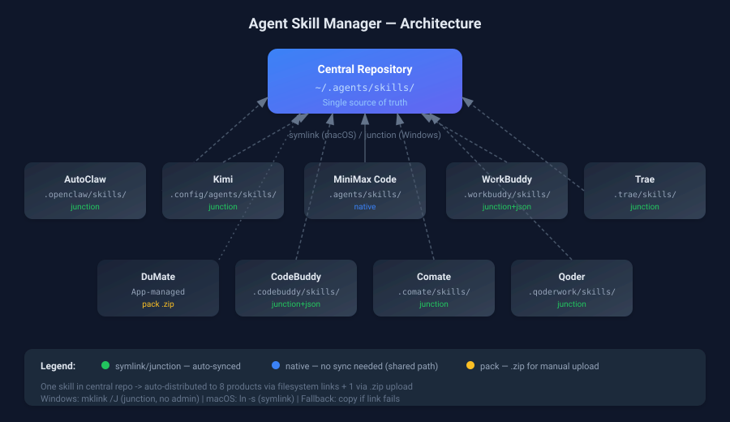
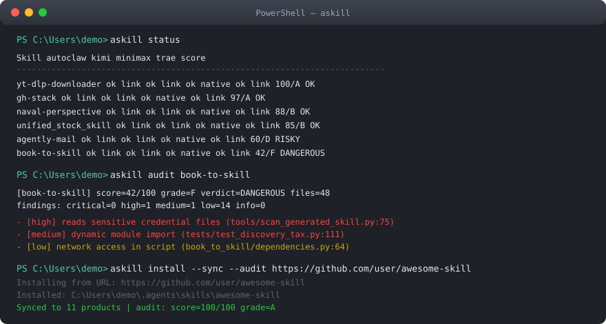

<div align="center">


# Agent Skill Manager

[English](README.en.md) | [简体中文](README.md)

[](https://www.python.org/)
[](https://github.com/yxdwind/agent-skill-manager)
[](LICENSE)
[](https://github.com/yxdwind/agent-skill-manager/actions/workflows/ci.yml) [](tests/)
[](https://skills.sh/yxdwind/agent-skill-manager)
[](#支持的产品)

**一次开发，十五端同步** — 跨平台统一管理国内 AI Agent 产品的 Skill 安装与同步

[安装](#安装) · [使用](#使用) · [二次开发](#二次开发) · [架构原理](#架构原理)

</div>

---

## 痛点

每个国产 AI Agent 产品都有自己独立的 skill 目录，开发一个 skill 要手动复制到每个产品：

```
~/.openclaw-autoclaw/skills/my-skill/   ← AutoClaw2
~/.config/agents/skills/my-skill/      ← Kimi
~/.workbuddy/skills/my-skill/          ← WorkBuddy
~/.trae-cn/skills/my-skill/            ← Trae CN
~/.codebuddy/skills/my-skill/          ← CodeBuddy
~/.comate/skills/my-skill/             ← Comate
~/.qoder-cn/skills/my-skill/           ← Qoder CN
... 每改一次都要重复一遍
```

**agent-skill-manager** 用「中央仓库 + 一键分发」解决这个问题：改一处，全同步。

## 支持的产品（15 个）

| 产品 | 公司 | macOS 目录 | Windows 目录 | Linux 目录 | 同步方式 |
|------|------|-----------|-------------|-----------|----------|
| AutoClaw2 | 智谱 | `~/.openclaw-autoclaw/skills/` | `%USERPROFILE%\.openclaw-autoclaw\skills\` | 同 macOS | symlink/junction |
| Kimi | 月之暗面 | `~/.config/agents/skills/` | `%USERPROFILE%\.config\agents\skills\` | 同 macOS | symlink/junction |
| MiniMax Code | MiniMax | `~/.agents/skills/` | `%USERPROFILE%\.agents\skills\` | 同 macOS | 原生支持 |
| WorkBuddy | 腾讯 | `~/.workbuddy/skills/` | `%USERPROFILE%\.workbuddy\skills\` | — | symlink + settings.json |
| Trae | 字节跳动 | `~/.trae/skills/` | `%USERPROFILE%\.trae\skills\` | — | symlink/junction |
| Trae CN | 字节跳动 | `~/.trae-cn/skills/` | `%USERPROFILE%\.trae-cn\skills\` | — | symlink/junction |
| TRAE SOLO CN | 字节跳动 | `~/.trae-cn/skills/`（与 Trae CN 共用） | `%USERPROFILE%\.trae-cn\skills\` | — | symlink/junction |
| DuMate | 百度 | App 内管理 | App 内管理 | App 内管理（zip 打包可用） | 打包 .zip 上传 |
| CodeBuddy | 腾讯 | `~/.codebuddy/skills/` | `%USERPROFILE%\.codebuddy\skills\` | 同 macOS | symlink + settings.json |
| Comate / 文心快码 | 百度 | `~/.comate/skills/` | `%USERPROFILE%\.comate\skills\` | 同 macOS | symlink/junction |
| Qoder CN | 阿里 | `~/.qoder-cn/skills/` | `%USERPROFILE%\.qoder-cn\skills\` | — | symlink/junction |
| Qoder CN IDE | 阿里 | `~/.qoder-cn/skills/`（与 Qoder CN 共用） | `%USERPROFILE%\.qoder-cn\skills\` | — | symlink/junction |
| QwenWork / 千问办公 | 阿里 | `~/.qwenworkcn/skills/` | `%USERPROFILE%\.qwenworkcn\skills\` | — | symlink/junction |
| DoubaoWork / 豆包工作 | 字节跳动 | `~/.super_doubao/super-doubao-runtime/workspace/.user_skills/` | `%LOCALAPPDATA%\DoubaoWork\User Data\Default\.doubaowork\agent_mode\workspace\.user_skills\` | — | symlink/junction |
| ZCode | ZCode | `~/.zcode/skills/` | `%USERPROFILE%\.zcode\skills\` | 同 macOS | symlink/junction |

> **Linux 支持（v0.10.0）**：CLI 类产品（AutoClaw2、Kimi、MiniMax Code、CodeBuddy、Comate、ZCode）在 Linux 上走相同的 dotdir 约定 + 原生 symlink；DuMate 的 zip 打包全平台可用。暂无 Linux 版本的桌面/IDE 产品自动跳过（`askill products` 显示 N/A），产品发布 Linux 版后补充 `linux_path` 即可。

> **完整能力矩阵（v0.13.0）**：逐产品的路径 / 同步方式 / settings 开关 / frontmatter 要求 / 各命令支持状态盘点见 [docs/product-matrix.md](docs/product-matrix.md)。

## 架构原理



**核心设计**：中央仓库 `~/.agents/skills/` 作为唯一权威源，通过 symlink（macOS/Linux）或 junction（Windows）自动分发到各产品。对不支持文件系统的 DuMate，打包为 .zip 手动上传；QwenWork/豆包工作 同样支持 junction 同步。

- **Windows**：使用 `mklink /J` 创建 junction，无需管理员权限
- **macOS / Linux**：使用 `ln -s` 创建 symlink
- **自动降级**：链接创建失败时自动降级为复制模式
- **冲突保护（v0.13.0）**：产品目录中已存在与中央仓库内容不同的同名真实目录时，sync 跳过并警告（`--force` 才覆盖），绝不静默清掉你手动维护的技能
- **零依赖**：仅使用 Python 标准库



## 安装

```bash
# 从 PyPI 安装（推荐）
pip install cn-skill-sync

# 开发模式安装
cd agent-skill-manager
pip install -e .

# 如果 pip 遇到 TLS 证书问题
python -m pip install -e . --no-build-isolation
```

安装后 `askill` 命令全局可用。

也可以通过 `npx skills` 生态安装：

```bash
# 安装 skill 定义到所有支持的 agent 产品
npx skills add yxdwind/agent-skill-manager
```

## 使用

```bash
# 查看所有产品的 skill 安装状态（含安全评测评分列）
askill status

# 一键同步所有 skill 到所有产品
askill sync

# 同步指定 skill
askill sync my-skill

# v0.13.0 冲突保护：产品目录里已有的同名"真实目录"（非链接）不会被静默覆盖，
# sync 会跳过并提示；确认要覆盖时加 --force
askill sync my-skill --force

# 列出中央仓库中的所有 skill（含安全评测评分）
askill list

# 安装 skill（本地路径 / GitHub URL / skills.sh 生态简写）
# v0.12.0 起：安装后默认自动跑 spec 检查 + 安全评测，risky/dangerous 高亮告警
# v0.13.0 起：还会检查各产品的 frontmatter 特殊要求（如 QwenWork 需要 description_zh）
askill install /path/to/skill-folder
askill install --sync /path/to/skill-folder          # 安装后自动同步到所有产品
askill install --audit /path/to/skill-folder         # 额外打印完整审计报告
askill install --no-audit /path/to/skill-folder      # 跳过默认安全检查
askill install --sync --audit <github-url>           # 同步 + 完整审计一起

# skills.sh 生态简写（v0.11.0，与 npx skills 语法一致）
askill search pdf                                    # 搜索 skills.sh 注册表
askill search pdf --install 1                        # 搜索并直接安装第 1 条结果
askill install anthropics/skills                     # owner/repo 简写
askill install anthropics/skills@pdf                 # 指定仓库内的某个 skill
askill install https://skills.sh/anthropics/skills/pdf   # skills.sh 页面 URL

# 支持多种 GitHub URL 格式（默认分支自动识别，无需手动指定 main/master）
askill install --sync https://github.com/user/repo                                # 仓库根目录的 SKILL.md
askill install --sync https://github.com/user/repo/tree/main/my-skill              # 指定分支的子目录
askill install --sync https://github.com/user/repo/blob/main/my-skill/SKILL.md     # 直达 SKILL.md 文件

# 从一个平台拉取 skill 到中央仓库，并同步到其他所有平台（adopt）
askill adopt autoclaw my-skill                       # 从 AutoClaw 采纳指定 skill
askill adopt kimi                                    # 从 Kimi 采纳全部 skill
# 安全评测（静态分析：提示注入 / 危险代码 / 敏感信息 / 二进制文件）
askill audit                                         # 评测中央仓库全部 skill
askill audit my-skill                                # 评测指定 skill

# 实时监听：skill 一改动自动同步到全部产品（v0.10.0 事件驱动）
askill watch                                         # 常驻监听 ~/.agents/skills/（原生文件事件）
askill watch --interval 5                            # 自定义降级轮询间隔（秒）

# skill 升级：GitHub 来源自动追踪，一键检测/应用更新（v0.8.0 新增）
askill update --check                                # 只检查有哪些更新
askill update my-skill                               # 更新指定 skill 并同步
askill update                                        # 检查并更新全部 tracked skill

# 从所有产品移除 skill
askill remove my-skill

# 为 DuMate 打包 skill 为 .zip
askill pack my-skill

# 创作与发布（v0.15.0）：脚手架 + 一键发布回 GitHub 生态
askill new my-skill --target qwenwork              # 脚手架：frontmatter 按产品要求预填
askill publish my-skill --repo owner/name          # 门禁校验 + dry run（--push 实发）

# 漂移检测（v0.16.0）：产品目录里与 central 分叉的技能（new / differs）
askill drift [product]

# 列出所有支持的产品
askill products
```

**退出码契约（v0.16.0 起）**：`0` 成功（含 dry-run、空结果）· `1` 操作失败（install/verify/publish 等没能完成任务）· `2` 用法错误——脚本可以用退出码判断成败，配合 `--json` 获得完整机器可读输出。

### 典型工作流

```
1. askill watch         ← 开启实时监听（推荐常驻）
2. 编辑 ~/.agents/skills/my-skill/SKILL.md   ← 保存即自动同步 + 安全复检
3. askill update --check ← 想升级时看看哪些 skill 有新版本
```

### 创作与发布（v0.15.0）

```
1. askill new my-skill --target qwenwork      ← 脚手架：frontmatter 按产品要求预填
2. askill publish my-skill --repo owner/name  ← 门禁校验 + dry run（--push 实发）
```

发布后的技能即可被 `askill install owner/repo@skill` 和 `npx skills add` 安装，skills.sh 随安装量自动收录排行。

## 项目结构

```
agent-skill-manager/
├── pyproject.toml              # PEP 621 项目配置
├── setup.py                    # setuptools 兼容入口
├── docs/
│   ├── architecture.svg        # 架构图
│   ├── demo.svg                # 终端演示图
│   ├── product-paths.md        # 各产品详细路径参考
│   └── product-matrix.md       # 产品能力矩阵盘点（v0.13.0 基线）
├── src/                        # 包根（映射为 agent_skill_manager 包）
│   ├── __init__.py / __main__.py
│   ├── config/products.py      # 15 个产品定义（路径/sync方式/settings/共享目录/
│   │                           # 产品级 frontmatter 要求，全部声明式）
│   ├── controllers/cli.py      # CLI 命令（17 commands）
│   ├── models/                 # TypedDict 数据模型
│   ├── services/               # 业务逻辑（sync / audit / watch / sources
│   │                           #             / registry / spec）
│   └── utils/                  # filesystem.py（跨平台文件操作）
│                               # watcher.py（原生文件事件：inotify/kqueue/ReadDirectoryChangesW）
└── tests/                      # 194 个测试
    ├── test_products.py
    ├── test_utils.py
    ├── test_core.py
    ├── test_adopt.py
    ├── test_security.py
    ├── test_cli.py
    ├── test_watch.py
    ├── test_watcher.py
    ├── test_registry.py
    ├── test_spec.py
    └── test_matrix.py          # 跨产品一致性回归锁定（v0.13.0）
```

## 实时监听与升级（v0.8.0 / v0.10.0）

### askill watch — 改完即同步（v0.10.0 升级为事件驱动）

`askill watch` 常驻监听中央仓库，默认挂起在**操作系统原生文件事件**上，零第三方依赖：

- **事件驱动**：Linux 用 inotify、macOS 用 kqueue、Windows 用 ReadDirectoryChangesW（全部标准库 ctypes/select 实现）；文件一保存即刻感知，实测延迟约 0.4 秒（含去抖），不再是固定 3 秒轮询
- **去抖合并**：编辑器一次保存的多个 syscall 事件合并为一次同步，只重同步真正变化的 skill
- **全量对账**：事件模式下每 30 秒仍做一次快照兜底，防事件丢失（队列溢出、目录替换、根目录重建）
- **新增/修改** skill → 自动同步到全部产品，实时打印每个产品结果
- **冲突/打包提示（v0.13.0）** → 产品目录有同名冲突时保留本地并提示处理方式；DuMate 等 pack 类产品会提示运行 `askill pack` 刷新压缩包
- **删除** skill → 自动清理所有产品残留链接，杜绝死链（根目录被删也能感知）
- **安全复检** → 每次同步后重跑 audit；安全评级从 safe 跌到 risky/dangerous 时高亮告警并列出主要问题
- **自动降级** → 原生事件不可用（受限内核等）或运行中失效时，自动退回轮询模式（`--interval` 可调，默认 3 秒），监听永不中断

### askill update — 来源追踪与一键升级

通过 GitHub URL 安装的 skill 会自动记录来源（仓库/路径/分支/commit）到 `~/.agents/skills/.askill-sources.json`：

```bash
askill update --check      # 列出哪些 skill 远端有新版本
askill update              # 检查并应用全部更新（更新后自动同步 + 复检）
askill update my-skill     # 只更新指定 skill
```

## skills.sh 生态接入（v0.11.0）

[skills.sh](https://skills.sh)（Vercel Labs）是开放 Agent Skills 生态（[agentskills.io](https://agentskills.io) 规范）的事实注册表。askill 三个方向接入，全程零依赖（标准库 urllib）：

**① 消费生态**——装 skills.sh 上的任何技能，不再需要 Node：

```bash
askill search pdf                        # 搜索注册表（名称/来源/装机量）
askill search pdf --install 1            # 直接安装第 N 条结果
askill install anthropics/skills@pdf     # 简写安装，与 npx skills add 语法一致
askill install https://skills.sh/anthropics/skills/pdf   # 粘贴 skills.sh 页面链接也行
```

**② 发布到生态**——中央仓库 `~/.agents/skills/` 本身就是规范布局（每个技能一个含 SKILL.md 的目录），推到 GitHub 即可被 skills.sh 收录、被所有兼容 agent 读取：

```bash
askill verify            # 按 agentskills.io 规范逐项检查（name/description/长度/目录匹配）
askill verify my-skill   # 只查一个；errors 阻断收录，warnings 仅建议（如正文超 500 行）
```

v0.13.0 起还会追加**按产品 frontmatter 要求**检查（如 QwenWork 需要 `name`+`version`+`description`+`description_zh`），缺失字段会逐产品列出；`askill install` 后也会自动提示，避免"装完了产品却加载不出来"。

**③ 双向桥接**——用 `npx skills add -g <repo>` 装到各产品目录的技能，一条命令收编进中央仓库并分发到其余产品：

```bash
npx skills add -g anthropics/skills      # 先用 skills CLI 装到它支持的产品
askill adopt all                          # 扫描全部产品目录，收编 + 分发到 15 个国产产品
```

## 安全评测（audit）

`askill audit` 对 skill 做**零依赖静态分析**，从 100 分起扣，按严重级别加权（每类封顶 40 分）：

| 检测维度 | 严重级别 | 示例 |
|---------|---------|------|
| 提示注入 | critical | "ignore all previous instructions"、绕过安全护栏指令 |
| 危险代码 | critical/high | `curl \| sh`、`rm -rf /`、`exec()`、`shell=True` |
| 敏感信息 | high/medium | 读取 `~/.ssh`、硬编码 API key、webhook 外发 |
| 二进制文件 | high | .exe/.dll 等可执行文件混入 skill |
| 文件完整性 | high/medium | 缺少 SKILL.md、超大文件、符号链接 |

**评分与结论**：A ≥ 90（safe）· B ≥ 80（safe）· C ≥ 70（caution）· D ≥ 60（risky）· F < 60（dangerous）

`askill list` 和 `askill status` 的输出中也会直接带上每个 skill 的评分（score/grade/结论）。**v0.12.0 起，每次 `askill install` 都默认运行 spec 检查 + 安全评测**（v0.13.0 起还包含按产品 frontmatter 要求检查）：干净时只打印一行 `[check]` 摘要，risky/dangerous 在任何模式下高亮告警；`--audit` 打印完整报告，`--no-audit` 跳过：

```bash
askill install --sync --audit https://github.com/user/repo/tree/main/my-skill   # 同步 + 完整审计报告
askill install --no-audit https://github.com/user/repo/tree/main/my-skill       # 跳过默认检查
```

## 二次开发

### 添加新产品

编辑 `src/config/products.py`，在 `PRODUCTS` 列表中添加：

```python
{
    "name": "新产品名称",
    "short": "short-name",
    "macos_path": HOME / ".newproduct" / "skills",
    "windows_path": HOME / ".newproduct" / "skills",
    "linux_path": HOME / ".newproduct" / "skills",  # 无 Linux 版则省略（或 None）
    "sync_method": "symlink",  # symlink | native | pack
    "note": "说明信息",
    "extra_dirs_macos": [],
    "extra_dirs_windows": [],
    "extra_dirs_linux": [],
    # v0.13.0 起的可选声明，按产品实际情况填写：
    # "settings_file": HOME / ".newproduct" / "settings.json",
    # "settings_mode": "skills-switch",           # settings.json 含 {"skills": {name: bool}}
    # "required_frontmatter": ["name", "version"],  # 产品额外要求的 SKILL.md 字段
}
```

声明到位后，sync/status/watch 的行为、frontmatter 校验和 `tests/test_matrix.py` 的一致性断言都会自动覆盖新产品，无需改其他代码。

### 运行测试

```bash
pip install pytest
pytest tests/ -v
```

### Shell 智能补全（v0.13.0）

仓库自带 bash / zsh / fish 补全脚本，零依赖：

```bash
# bash
source completion/askill.bash

# zsh — 拷贝到 $fpath 下任一目录后 compinit 即可
cp completion/_askill ${fpath[1]}/_askill

# fish
cp completion/askill.fish ~/.config/fish/completions/
```

补全会从 `askill list --quiet` / `askill products --json` 实时拉取 skill 名
与产品短名，所以新装的 skill 也会立刻出现在 Tab 候选里。

## 贡献

请阅读 [CONTRIBUTING.md](CONTRIBUTING.md) — 项目使用 Conventional Commits
（commitizen 强制），提交前本地跑 `ruff check src tests` + `mypy src` +
`pytest tests -q` 三件套，CI 与本地必须同绿。

## 相关项目

- [manage-my-skills](https://github.com/hchcx/manage-my-skills) — 跨平台 Skills 管理工具，支持 20+ 国际产品
- [awesome-agent-skills](https://github.com/libukai/awesome-agent-skills) — Agent Skills 终极指南
- [skills CLI](https://www.npmjs.com/package/skills) — npm 上的 agent skills 包管理器
- [skill-creator](https://github.com/yxdwind/agent-skill-manager) — Skill 编写规范参考

## 贡献者

感谢以下贡献者参与本项目开发：

- [**@GLM-5.2**](https://github.com/zai-org) — AI 协作开发（智谱 GLM-5.2）

## 安全与隐私

- [安全政策（SECURITY.md）](SECURITY.md) — 漏洞报告指引与安全建议
- [隐私政策（PRIVACY.md）](PRIVACY.md) — 数据本地处理说明

## 许可证

[MIT](LICENSE)
